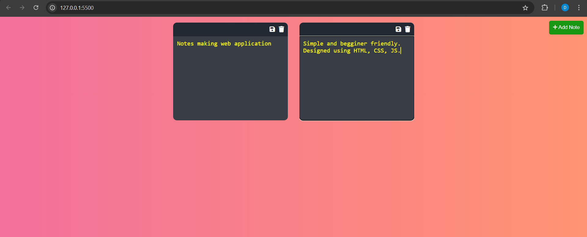

# Notes-Making Web Application



A simple web application designed for creating, saving, and managing notes. Built using HTML, CSS, and JavaScript, this app allows you to add notes using an "Add Note" button. The notes are saved to your browser’s local storage, ensuring they persist even after the browser is closed or the page is reloaded.

## Features

- **Add Notes:** Quickly add notes with the "Add Note" button.
- **Delete Button:** Delete the note.
- **Persistent Storage:** Notes are saved in the browser's local storage, so they remain available even after closing the application.
- **User-Friendly Interface:** Simple and intuitive design to easily manage your notes.

---

## Getting Started

### Prerequisites

- Make sure you have **Git** installed on your system.
- A web browser (Chrome, Firefox, Safari, etc.)

### How to Use

1. **Star and Fork the Repository**

   - Please star ⭐ and fork 🍴 this repository to support the project!

2. **Clone the Repository**

   Open your terminal and clone the forked repository using the following command:

   ```bash
   git clone https://github.com/your-username/notes-making-web-application.git
   ```

3. **Navigate to the Project Directory**

   ```bash
   cd notes-making-web-application
   ```

4. **Open the Application**

   Simply open the `index.html` file in your web browser:

   ```bash
   open index.html
   ```

   Or you can right-click the file and open it with your browser.

For run the application from your VS Code to your browser, You can simply use the Live Server extension of vs code.

---

## Usage

1. **Add Notes**: Click the "Add Note" button to create a new note.
2. **Save Notes**: Once added, your notes are automatically saved to the browser’s local storage.
3. **Persistent Notes**: Close the app or refresh the page; your notes will still be there when you return.

---

## Contributing

Feel free to contribute by submitting a pull request. Make sure to follow the standard Git flow:

1. **Fork** the repository.
2. **Clone** your forked repository.
3. Create a new **branch** for your feature:
   ```bash
   git checkout -b feature-branch
   ```
4. **Commit** your changes:
   ```bash
   git commit -m "Add some feature"
   ```
5. **Push** to the branch:
   ```bash
   git push origin feature-branch
   ```
6. Open a **pull request**.

---

## License

This project is open-source and free to use.

---

Thank you for checking out the project! Don’t forget to **star** ⭐ and **fork** 🍴 the repository!
